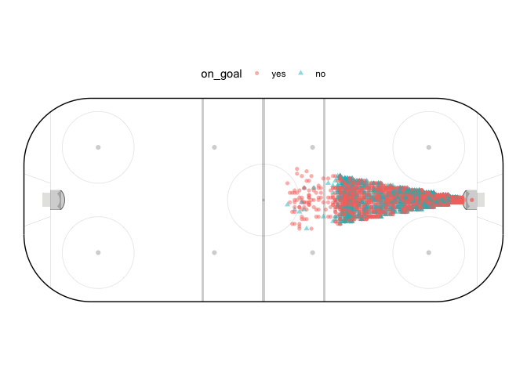

<!-- README.md is generated from README.Rmd. Please edit that file -->

# ongoal

<!-- badges: start -->

[](https://lifecycle.r-lib.org/articles/stages.html#experimental)
[](https://CRAN.R-project.org/package=ongoal)
<!-- badges: end -->

ongoal makes 25324 data points available for Pittsburgh Penguins games
where the it was determined whether a shot was on goal (i.e., made it to
the goaltender) or not (i.e., missed or blocked). Data are from seasons
2015-2016, 2016-2017, and 2017-2018.

Several other columns were recorded related to the game, player, and
shot. The data are not perfect; the determination of power play duration
were manually calculated and may not be completely accurate.

## Installation

You can install the development version of ongoal:

``` r
require(pak)
pak::pak("topepo/ongoal")
```

## Example

Here’s a look at the data:

``` r
library(ongoal)
str(on_goal)
#> Classes 'tbl_df', 'tbl' and 'data.frame':    25324 obs. of  24 variables:
#>  $ season             : Factor w/ 3 levels "20152016","20162017",..: 1 1 1 1 1 1 1 1 1 1 ...
#>  $ game_id            : int  2015020010 2015020010 2015020010 2015020010 2015020010 2015020010 2015020010 2015020010 2015020010 2015020010 ...
#>  $ event_idx          : num  6 9 17 19 41 48 62 84 99 100 ...
#>  $ date_time          : Factor w/ 27832 levels "2015-10-09T00:44:51Z",..: 2 3 4 5 8 9 10 12 14 15 ...
#>  $ event              : Factor w/ 4 levels "Blocked Shot",..: 1 4 3 2 4 1 1 4 4 4 ...
#>  $ on_goal            : Factor w/ 2 levels "yes","no": 2 1 2 1 1 2 2 1 1 1 ...
#>  $ period             : int  1 1 1 1 1 1 1 1 1 1 ...
#>  $ game_seconds       : num  36 47 92 99 220 252 309 427 527 541 ...
#>  $ strength           : Factor w/ 3 levels "even","power_play",..: 3 2 2 3 3 3 3 3 3 2 ...
#>  $ strength_state     : Factor w/ 15 levels "3v4","3v5","3v6",..: 11 14 14 11 11 11 11 11 11 14 ...
#>  $ extra_attacker     : num  0 1 1 0 0 0 0 0 0 1 ...
#>  $ home_skaters       : num  5 5 5 5 5 5 5 5 5 5 ...
#>  $ away_skaters       : num  6 6 6 6 6 6 6 6 6 6 ...
#>  $ goaltender         : Factor w/ 78 levels "aaron_dell","al_montoya",..: 11 11 11 53 53 11 11 53 53 11 ...
#>  $ goal_difference    : num  0 0 0 1 1 -1 -1 1 1 -1 ...
#>  $ shooter            : Factor w/ 915 levels "aaron_ekblad",..: 875 714 78 577 699 63 361 20 377 738 ...
#>  $ shooter_team       : Factor w/ 31 levels "ANA","ARI","BOS",..: 10 23 23 10 10 10 10 10 10 23 ...
#>  $ shooter_nationality: Factor w/ 19 levels "AUT","BLR","CAN",..: 15 19 19 18 3 9 3 19 3 19 ...
#>  $ shooter_type       : Factor w/ 5 levels "center","defenseman",..: 5 5 5 1 4 4 4 2 1 2 ...
#>  $ coord_x            : num  -49 64 65 80 62 -67 -58 56 50 49 ...
#>  $ coord_y            : num  -21 -31 -21 13 15 -9 -16 25 21 5 ...
#>  $ angle              : num  8.65 51.12 41.19 55.3 29.05 ...
#>  $ distance           : num  139.6 39.8 31.9 15.8 30.9 ...
#>  $ behind_goal_line   : num  0 0 0 0 0 0 0 0 0 0 ...
```

There’s also a visualization function (based on [Bill Tran’s
function](https://raw.githubusercontent.com/mrbilltran/the-win-column/master/nhl_rink_plot.R)):

``` r
suppressPackageStartupMessages(library(dplyr))
set.seed(1)
on_goal %>% 
  filter(abs(angle) < 20 & distance < 40) %>% 
  sample_n(500) %>% 
  plot_nhl_shots(emphasis = on_goal, alpha = 1 / 2)
```



## Future plans

I might make a different version of the data and plotting function that
use the absolute x coordinate so that we only have to plot half the
rink.

## Code of Conduct

Please note that the ongoal project is released with a [Contributor Code
of
Conduct](https://contributor-covenant.org/version/2/0/CODE_OF_CONDUCT.html).
By contributing to this project, you agree to abide by its terms.
